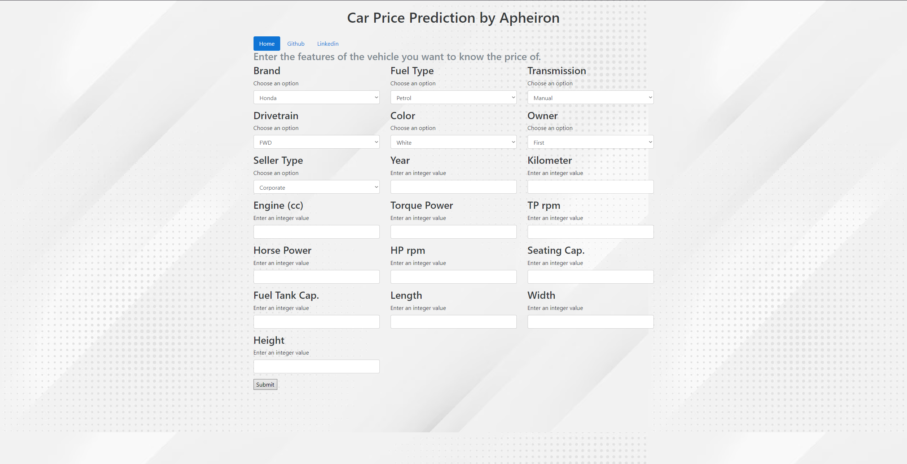
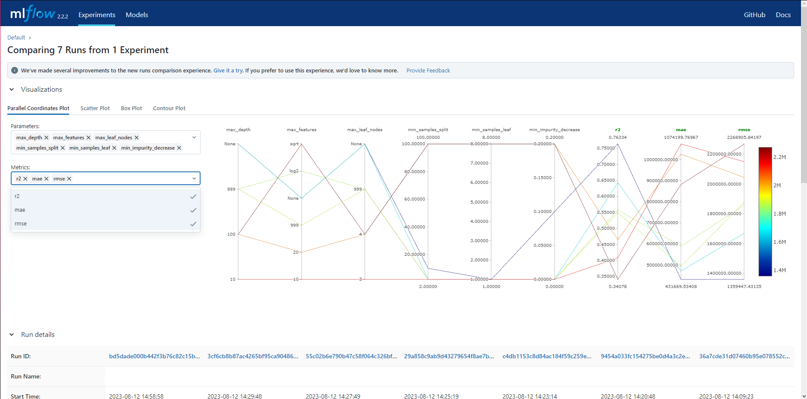
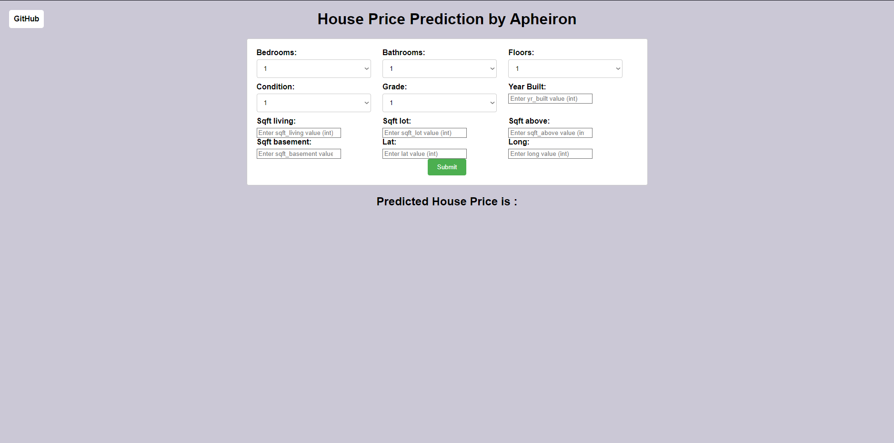

## Table of Contents
- [Computer Vision](#-computer-vision)
  - [Galaxy Images Classification](galaxy-images-classification---tensorflow-|-flask-|-docker-|-aws)
- [Data Science](#-data-science)

*Updated: 12/02/2024*

 
## 🤖 Computer Vision 

### Galaxy Images Classification - Tensorflow | Flask | Docker | AWS

This project focuses on using deep learning techniques to classify different types of galaxies based on their images. The goal is to develop a machine learning model that can accurately distinguish between various galaxy shapes and configurations.

- Developing a galaxy classification model that recognizes various galaxy types with 90% accuracy
- Creating a user-friendly interface to increase astronomical understanding
- Ensure scalability and consistencywith Docker for efficient deployment
- Provide global availability by distributing the project on AWS EC2 for broad use

### Moon Shape Classification using YOLO and Roboflow

Developed a computer vision model using YOLO and Roboflow for moon shape classification.

- Handled a dataset of 1370 images with 8 classes.
- Implemented preprocessing techniques like auto-orient and resizing to 640x640 pixels.
- Enhanced dataset quality with augmentations: grayscale, saturation, brightness, exposure adjustments, blur, and noise.
- Calculated an F1 Score of approximately 81.0%, balancing precision and recall, signifying a robust model performance in moon shape classification.

## 📈 Data Science
### End-to-End Car Price Regression - MLflow | Flask

- Developed a regression model to predict car prices using 19 columns as features.
- Utilized MLflow to track experiments, including parameter tuning, model performance, and version control.
- Achieved an R-squared value of %79.
- Implemented DecisionTreeRegressor to establish relationships between features and car price.

### End-to-End House Price Regression - Docker | Flask

- Engineered a predictive model to estimate house prices based on 12 distinct variables.
- Employed CatBoost, a gradient boosting framework, to train the regression model owing to its high performance and handling of categorical features.
- Packaged the application using Docker to ensure consistent environments and reproducibility across different systems.

