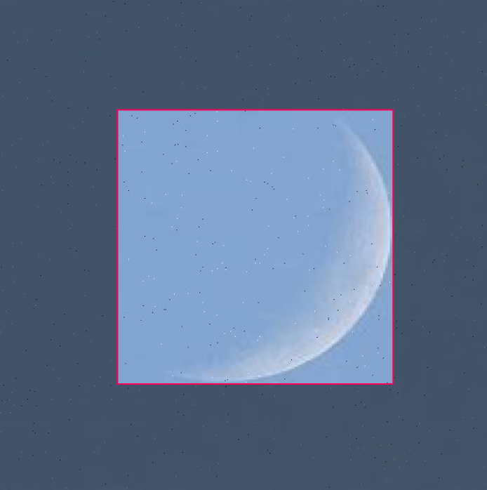

*Updated: 12/02/2024*

## 🤖 Computer Vision
### Moon Shape Classification using YOLO and Roboflow

Developed a computer vision model using YOLO and Roboflow for moon shape classification.

- Handled a dataset of 1370 images with 8 classes.
- Implemented preprocessing techniques like auto-orient and resizing to 640x640 pixels.
- Enhanced dataset quality with augmentations: grayscale, saturation, brightness, exposure adjustments, blur, and noise.
- Calculated an F1 Score of approximately 81.0%, balancing precision and recall, signifying a robust model performance in moon shape classification.

### Visual Recognition for Vietnamese Foods

I built a Computer Vision application to recognize popular Vietnamese dishes and display their information and stories. To build the application, I crawled 6,000 images using the Bing Image Search API and trained a ResNet-50 model. The model achieved 94% accuracy over 11 classes.

{: .align-center}

### CS231n: Convolutional Neural Networks for Visual Recognition

This is my complete implementation of assignments and projects in [***CS231n: Convolutional Neural Networks for Visual Recognition***](http://cs231n.stanford.edu/) by Stanford (Spring, 2019). NumPy implementations of forward and backward pass of each layer in a convolutional neural network have given me a deep understanding of how state-of-the-art Computer Vision architectures work under the hood. In addition, I explored the inner beauty of Deep Learning by implementing Style Transfer, Deep Dream, Texture Systhesis in PyTorch and generating new images with GANs.

**Selective Topics:**
- [NumPy Implementations of CNN](https://github.com/chriskhanhtran/CS231n-CV/blob/master/assignment2/cs231n/layers.py): Fully-connected Layer, Batchnorm, Layernorm, Dropout, Convolution, Maxpool.
- [Image Captioning with LSTMs](https://github.com/chriskhanhtran/CS231n-CV/blob/master/assignment3/LSTM_Captioning.ipynb)
- [Saliency Maps, Deep Dream, Fooling Images](https://github.com/chriskhanhtran/CS231n-CV/blob/master/assignment3/NetworkVisualization-PyTorch.ipynb)
- [Style Transfer](https://github.com/chriskhanhtran/CS231n-CV/blob/master/assignment3/StyleTransfer-PyTorch.ipynb)
- [Generative Adversarial Networks (GANs)](https://github.com/chriskhanhtran/CS231n-CV/blob/master/assignment3/Generative_Adversarial_Networks_PyTorch.ipynb)

## 📈 Data Science
### Credit Risk Prediction Web App

After my team preprocessed a dataset of 10K credit applications and built machine learning models to predict credit default risk, I built an interactive user interface with Streamlit and hosted the web app on Heroku server.

{: .align-center}

---
### Kaggle Competition: Predict Ames House Price using Lasso, Ridge, XGBoost and LightGBM

I performed comprehensive EDA to understand important variables, handled missing values, outliers, performed feature engineering, and ensembled machine learning models to predict house prices. My best model had Mean Absolute Error (MAE) of 12293.919, ranking **95/15502**, approximately **top 0.6%** in the Kaggle leaderboard.

{: .align-center}

---
### Predict Breast Cancer with RF, PCA and SVM using Python

In this project I am going to perform comprehensive EDA on the breast cancer dataset, then transform the data using Principal Components Analysis (PCA) and use Support Vector Machine (SVM) model to predict whether a patient has breast cancer.

{: .align-center}

---
### Business Analytics Conference 2018: How is NYC's Government Using Money?

In three-month research and a two-day hackathon, I led a team of four students to discover insights from 6 million records of NYC and Boston government spending data sets and won runner-up prize for the best research poster out of 18 participating colleges.

{: .align-center}
